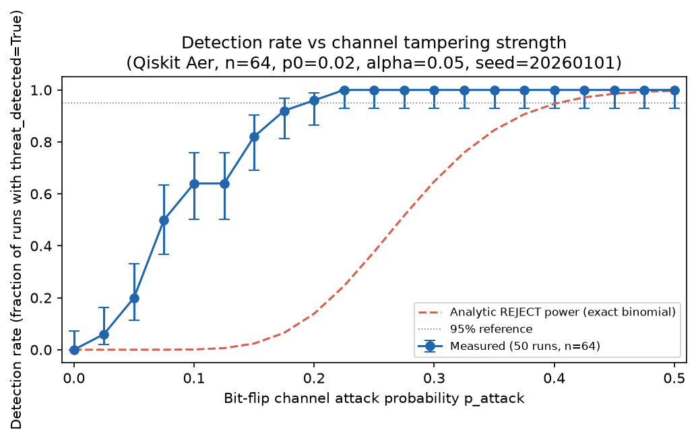
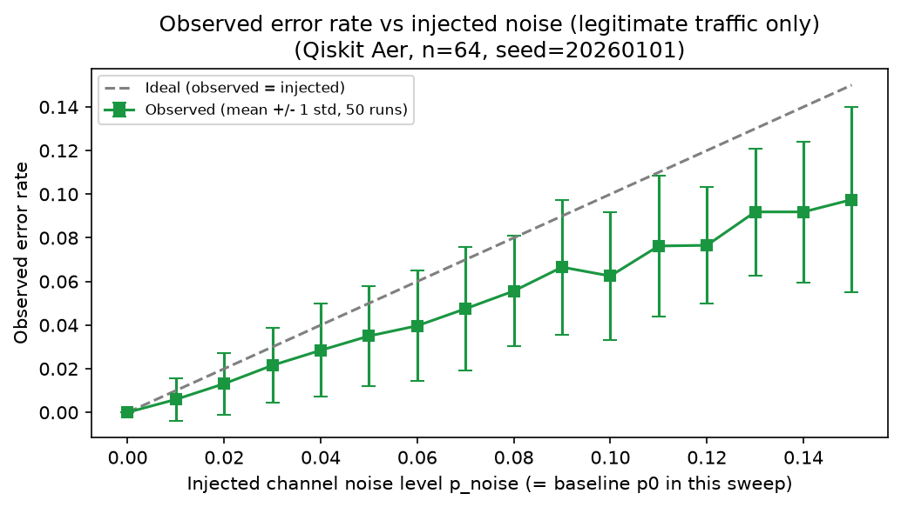
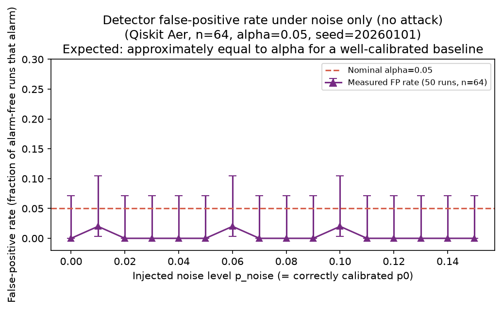
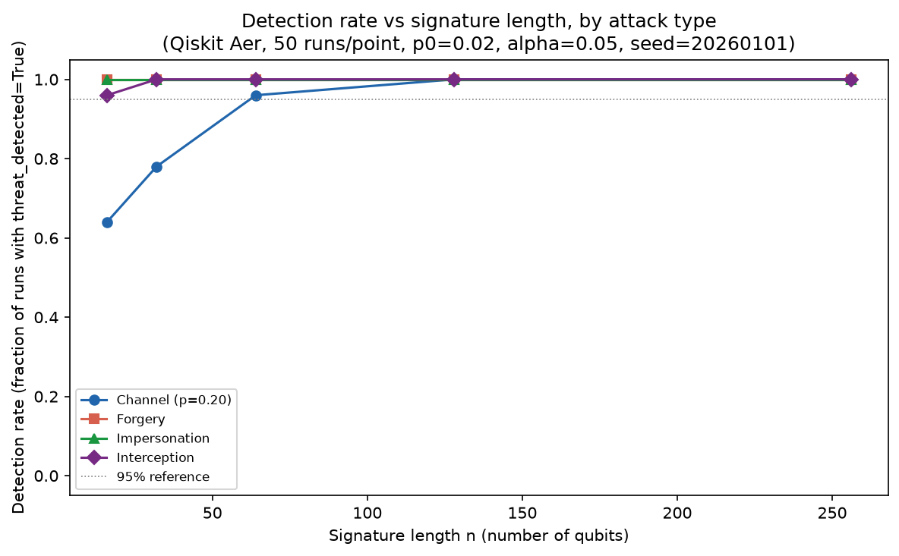
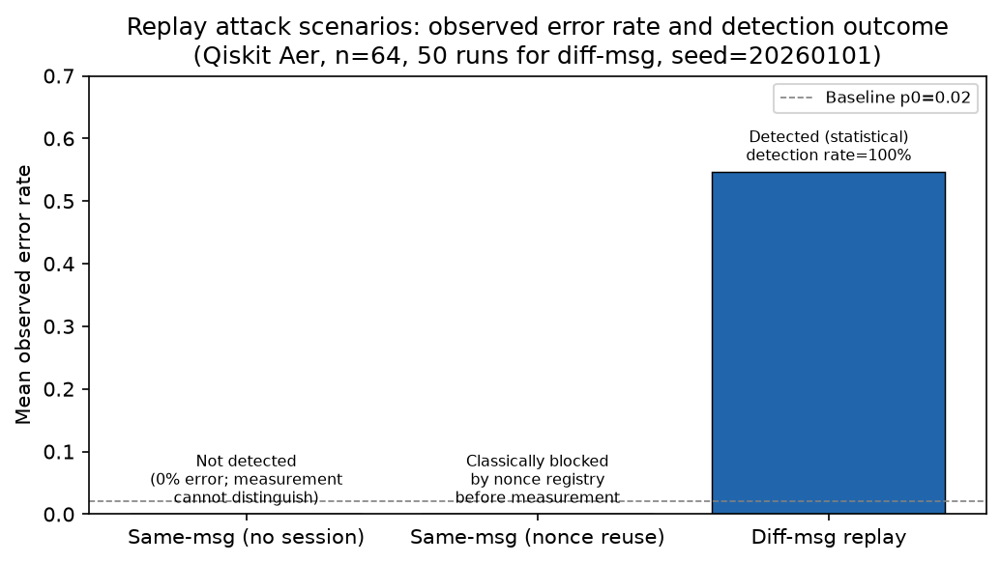

# Symmetric-Key, Signature-Style Authentication Scheme (QDS-Style): Simulation and Threat Detection Testbed

> **Status:** Research prototype / simulation testbed; not a security proof.

This repository provides an open simulation and benchmarking testbed for a teleportation-based symmetric-key, signature-style authentication scheme (QDS-style), implemented in Python with Qiskit and Streamlit. The system models message-to-quantum state encoding, quantum teleportation of Pauli eigenstates, exact non-machine-learning statistical anomaly detection, deterministic basis-resolved threat classification, and classical session-nonce freshness binding.

**Fundamental Scope Notice:**
This protocol is a symmetric-key authentication scheme. Because Bob shares the exact secret key $K$ with Alice, Bob has identical capabilities to Alice and could generate any signature that Alice produces. Consequently, this scheme does **NOT** provide non-repudiation or multi-party transferability.

**Central Research Question:**
*How does hardware noise limit detection in a teleportation-based QDS-style scheme, and can a session nonce close the same-message replay gap?*

---

## Related Work

- **Gottesman and Chuang (2001):** *"Quantum digital signatures"* (arXiv:quant-ph/0105032) established the theoretical foundations of quantum digital signatures using quantum memory and asymmetric public key distribution to achieve non-repudiation and information-theoretic unforgeability. (verify details)
- **Dunjko, Wallden, and Andersson (2014):** *"Quantum digital signatures without quantum memory"* (Phys. Rev. Lett. 112, 040502) demonstrated that QDS protocols can be implemented using coherent states and standard optical components without requiring long-term quantum memory. (verify details)

**How this testbed differs:**
This project does not implement an asymmetric multi-recipient QDS protocol with information-theoretic transferability. Instead, it investigates a two-party symmetric-key authentication primitive that transmits Pauli eigenstates via 3-qubit teleportation circuits in classical simulation. It evaluates physical channel anomaly detection, basis-resolved threat discrimination, and classical replay defense under environmental noise.

---

## Threat Model and Assumptions

### Protocol Setup
1. **Key Establishment:** Alice and Bob share a secret key vector $K \in \{0, 1\}^{256}$, either pre-shared or established via entanglement-based BBM92 Quantum Key Distribution.
2. **Payload Binding:** The classical message $M$ is bound to a signer identifier, counter, timestamp, and single-use session nonce $N$:
   $$P = M \parallel \mathrm{signer\_id} \parallel N \parallel \mathrm{counter} \parallel \mathrm{timestamp}$$
   The bound digest is $D = \text{SHA-256}(P) = (d_0, d_1, \dots, d_{255})$.
3. **State Encoding:** Each digest bit $d_i$ is combined with key bit $K_i$ via $b_i = d_i \oplus K_i$. Bit $b_i$ selects an eigenstate from one of six Pauli states across a deterministic public basis schedule ($i \pmod 3 \in \{Z, X, Y\}$):
   - $Z$: $|0\rangle$ ($+1$), $|1\rangle$ ($-1$)
   - $X$: $|+\rangle$ ($+1$), $|-\rangle$ ($-1$)
   - $Y$: $|+i\rangle$ ($+1$), $|-i\rangle$ ($-1$)
4. **Transmission:** Alice teleports each state to Bob using sequential 3-qubit teleportation circuits with Bell-state measurements and feedforward Pauli corrections ($X^{c_1} Z^{c_0}$).
5. **Verification:** Bob measures each received state in Alice's assigned basis. In a noiseless channel with a legitimate signature, measurement eigenvalues match expectations with probability 1.0. Observed error counts are evaluated using exact one-sided Binomial hypothesis testing ($H_0: p = p_0$ vs $H_1: p > p_0$).

### Adversary Capabilities and Threat Classes
The adversary Eve sits on the quantum channel between Alice and Bob under an individual-qubit attack model:
1. **Channel Tampering:** Injects physical bit-flip noise (Pauli-$X$) on the transmission channel with probability $p$.
2. **Signature Forgery:** Knows message $M$ and digest $D$, but does not know secret key $K$. Attempts state preparation assuming $K = 0$.
3. **Impersonation:** Randomly guesses encoded states ($\text{Bernoulli}(0.5)$) without knowledge of $K$.
4. **Quantum Interception (Blind Intercept-Resend):** Measures transmitted qubits in randomly selected bases and re-sends the collapsed eigenstates.
5. **Replay Attacks:** Captures a previously valid quantum signature:
   - *Different-Message Replay:* Replays a captured signature for message $M'$ against target message $M$.
   - *Same-Message Replay (Legacy Mode):* Replays captured states verbatim without session binding.
   - *Same-Message Replay (Protected Mode):* Replays captured states against an append-only NonceRegistry.
6. **Unauthorized Verification:** An adversary attempts verification without a valid constant-time HMAC-SHA256 token.
7. **Basis-Aware Interception:** An active individual-qubit interceptor who knows the deterministic basis schedule ($i \pmod 3$) measures in the assigned basis to extract key bits without state disturbance.

### Explicit Cryptographic Assumptions
- The public classical channel used for BBM92 sifting and teleportation correction bits is assumed to be authenticated.
- Coherent, collective, and adaptive quantum attacks are not modeled.
- Baseline noise $p_0$ is a calibrated experimental parameter, not a universal physical constant.
- The classical HMAC secret and `NonceRegistry` are assumed to be securely managed.

---

## Experimental Results

All experiments below were generated using Qiskit Aer (`AerSimulator`) with fixed random seed `20260101` and $N = 50$ independent repetitions per data point via `python evaluation/make_results.py` (total runtime: 1135.5s / 18.93 min). Data points show measured means with Wilson 95% confidence intervals.

### Figure 1: Detection Rate vs. Channel Tampering Strength

*Data source: [`results/detection_vs_attack_strength.csv`](results/detection_vs_attack_strength.csv)*

**Observation:** At baseline calibration $p_0 = 0.02$ and $\alpha = 0.05$ ($n = 64$), the detection rate is 0.00 at $p = 0.000$, rises to 0.06 at $p = 0.025$, 0.20 at $p = 0.050$, 0.50 at $p = 0.075$, 0.64 at $p = 0.100$, 0.82 at $p = 0.150$, 0.92 at $p = 0.175$, 0.96 at $p = 0.200$, and achieves 1.00 for $p \ge 0.225$. Weak channel disturbances below $p \approx 0.05$ remain difficult to distinguish from baseline noise under finite sampling.

### Figure 2: Observed Error Rate vs. Injected Baseline Noise

*Data source: [`results/error_rate_vs_noise.csv`](results/error_rate_vs_noise.csv)*

**Observation:** Under legitimate traffic subjected to physical Pauli-$X$ channel noise at probability $p_{\text{noise}}$, the observed error rate follows $\frac{2}{3} p_{\text{noise}}$ (e.g., mean error 0.0350 at $p = 0.05$, 0.0625 at $p = 0.10$, and 0.0975 at $p = 0.15$). This matches theory because Pauli-$X$ transforms $Z$ and $Y$ eigenstates but leaves the $X$ basis undisturbed.

### Figure 3: Detector False-Positive Rate Under Calibrated Noise

*Data source: [`results/false_positive_rate.csv`](results/false_positive_rate.csv)*

**Observation:** When the detector's baseline parameter $p_0$ is correctly calibrated to the channel noise level, the empirical false-positive rate across 50 trials per level is 0.00 for 13 of 16 tested levels, and 0.02 (1/50) for three levels ($p = 0.01, 0.06, 0.10$). The maximum observed false-alarm rate is 0.02, remaining well within the nominal significance threshold $\alpha = 0.05$.

### Figure 4: Detection Rate vs. Signature Length ($n$)

*Data source: [`results/detection_vs_n.csv`](results/detection_vs_n.csv)*

**Observation:** Signature forgery and random impersonation achieve a 1.00 detection rate across all tested signature lengths ($n \in \{16, 32, 64, 128, 256\}$) due to their ~50% error rate. Interception achieves 0.96 at $n = 16$ and 1.00 for $n \ge 32$. Channel tampering at $p = 0.20$ (theoretical error rate $\frac{2}{3} \times 0.20 \approx 0.1333$ or $13.33\%$) achieves detection rates of 0.64 ($n = 16$), 0.78 ($n = 32$), 0.96 ($n = 64$), and 1.00 ($n \ge 128$).

### Figure 5: Replay Attack Scenarios and Nonce Binding

*Data source: [`results/replay_scenarios.csv`](results/replay_scenarios.csv)*

**Observation:** Without session binding, same-message replay produces an observed error rate of 0.0000 and is undetectable by quantum measurement. Binding a session nonce allows the verifier's `NonceRegistry` to block the replay classically in $\mathcal{O}(1)$ time prior to quantum measurement. Different-message replay produces a mean error rate of 0.5469 (theoretical 0.5352) and is detected with 1.00 probability across all 50 runs.

### Basis-Aware Adversary Benchmark
*Data source: [`results/basis_aware_attack.csv`](results/basis_aware_attack.csv); full analysis in [`docs/basis_aware_analysis.md`](docs/basis_aware_analysis.md)*

**Observation:** When an active individual-qubit adversary exploits the public deterministic basis schedule ($B_i = i \pmod 3$) to measure intercepted qubits in the known preparation basis, the measurement causes zero state-collapse disturbance. Across 50 simulation runs ($n = 64$, seed `20260101`):
- **Key leakage fraction:** 1.0000 (100% of the secret key bits recovered: $64 / 64$).
- **Bob's observed error rate:** 0.0000 (0 errors observed).
- **Detector detection rate:** 0.0000 (95% CI: $[0.0000, 0.0714]$).

This confirms that the public deterministic basis schedule completely breaks key confidentiality and unforgeability under active channel interception.

---

## Known Limitations

1. **Vulnerability to Basis-Aware Interception:** Because the basis schedule is public and deterministic ($i \pmod 3$), an active channel adversary who intercepts qubits measures in the correct basis with probability 1.0, extracting the secret key without inducing state collapse or detection. The scheme's security bounds hold only if the channel is secure against active interception or if basis choices are private and random.
2. **Two-Party Authentication Only (No Non-Repudiation):** The secret key $K$ is shared symmetrically between Alice and Bob. Bob holds all parameters required to generate a valid signature for any message. The scheme does not provide non-repudiation or multi-party transferability.
3. **Simulation vs. Physical Hardware:** The full 256-qubit evaluation executes on Qiskit Aer (classical simulation). Physical hardware execution via IBM Quantum is supported only for single representative 3-qubit teleportation primitives due to cloud queue latency and gate noise.
4. **No Composable Key Security:** While the BBM92 module simulates Bell-state measurements, sifting, and QBER threshold estimation, it does not implement classical information reconciliation (error correction) or privacy amplification.
5. **Restricted Adversary Model:** The threat simulation models only individual-qubit operations. Coherent, collective, and adaptive quantum measurement attacks are outside the scope of this implementation.
6. **Classical Freshness Dependencies:** The replay resistance mechanism and authorization checks rely on classical primitives (`secrets`, SHA-256, HMAC-SHA256). These provide computational and architectural guarantees rather than information-theoretic bounds.
7. **In-Memory Registry:** The `NonceRegistry` stores consumed nonces in volatile process memory and does not persist state across restarts.
8. **Noise Calibration Requirement:** The statistical decision engine requires an explicitly calibrated baseline error rate $p_0$. Disturbances weaker than the calibrated baseline noise floor are information-theoretically indistinguishable from channel noise.

---

## Reproducibility

### Environment Setup
```bash
git clone https://github.com/Naman-Vasudev/QKD.git
cd QKD
python -m venv .venv

# Linux / macOS
source .venv/bin/activate
# Windows PowerShell
.\.venv\Scripts\Activate.ps1

pip install -r requirements.txt
```

### Reproducing Benchmark Experiments
To regenerate all 6 CSV data tables in `results/` and PNG figures in `assets/results/`:
```bash
python evaluation/make_results.py
```

### Running Test Suite
To execute the automated regression test suite (223 tests):
```bash
pytest
```

### Running Interactive Web Laboratory
```bash
streamlit run app.py
```

---

## Project Structure

```
.
├── app.py                         # Streamlit web application (12 interactive modules)
├── requirements.txt               # Dependencies (qiskit, qiskit-aer, scipy, streamlit, etc.)
├── AUDIT.md                       # Codebase audit, CSV verification table, and design notes
├── docs/
│   ├── mathematical_model.md      # Formal protocol equations and LaTeX derivations
│   └── basis_aware_analysis.md    # Cryptographic analysis of basis-aware interception
├── qds/                           # Protocol core implementation
│   ├── encoding.py                # SHA-256 preprocessing, session binding, XOR key encoding
│   ├── states.py                  # 6 Pauli eigenstate preparation and basis rotations
│   ├── teleportation.py           # 3-qubit teleportation circuit construction and execution
│   ├── verification.py            # End-to-end verification pipeline (Auth -> Freshness -> Quantum)
│   ├── session.py                 # NonceRegistry, session binding, and HMAC authorization
│   └── keydist.py                 # BBM92 entanglement-based quantum key distribution
├── core/                          # Infrastructure and execution
│   ├── backend.py                 # Qiskit Aer and IBM noise model backend adapter
│   ├── hardware.py                # IBM Quantum cloud authentication and QPU discovery
│   ├── seeding.py                 # Unbiased PRNG seed derivation for simulator shots
│   ├── models.py                  # Dataclasses and type definitions
│   └── audit.py                   # Append-only JSONL security event logger
├── attacks/                       # Attack simulation modules
│   ├── channel.py                 # Pauli-X channel tampering simulation
│   ├── forgery.py                 # Digest-only signature forgery simulation
│   ├── impersonation.py           # Random guessing impersonation simulation
│   ├── interception.py            # Blind intercept-resend eavesdropping simulation
│   ├── basis_aware.py             # Basis-aware individual-qubit interception attack
│   ├── replay.py                  # Nonce-aware replay attack simulations
│   └── unauthorized.py            # Unauthorized verifier access simulation
├── qds_statistics/                # Statistical decision engine (non-ML)
│   ├── detector.py                # Exact Binomial hypothesis testing and decision thresholds
│   ├── classifier.py              # Basis-resolved error profiling and threat classification
│   └── bounds.py                  # Analytical forgery probability and detection power bounds
├── evaluation/                    # Benchmarking and experimental scripts
│   ├── make_results.py            # Reproducible experiment runner generating CSVs and figures
│   ├── runner.py                  # Unified scenario dispatcher and multi-attack sweeps
│   └── performance.py             # Empirical runtime complexity measurement
├── tests/                         # 223 automated unit tests
├── results/                       # Generated experimental CSV data tables
└── assets/results/                # Generated high-resolution experiment plots
```

---

## How to Cite or Reference This Work

Please reference this repository directly by URL:
[https://github.com/Naman-Vasudev/QKD.git](https://github.com/Naman-Vasudev/QKD.git)

---

## My Contribution

I designed the evaluation experiments, formulated the threat scenarios and statistical decision criteria, and directed the architecture and implementation, which used AI-assisted coding. This project began as a team submission for Smart India Hackathon 2026 (Problem Statement 5: Quantum-Inspired Cyber Threat Detection for Digital Signature Security; Team Ghost Protocol / EGRESO QUANTA) with three contributors, and was subsequently refined into an open simulation and benchmarking testbed.

---

## License

MIT License. Free to use, modify, and distribute with attribution.
